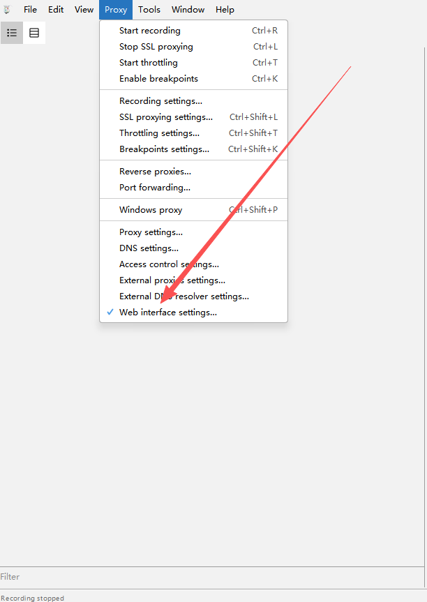
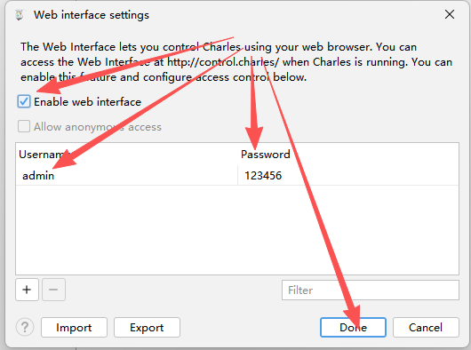

# Charles MCP Server

[English README](README.en.md) | [Tool Contract](docs/contracts/tools.md)

Charles MCP Server 用于把 Charles Proxy 接入 MCP 客户端，重点解决三个问题：

- 在 Charles 正在录制时，agent 能持续读取当前 session 的实时增量数据
- 对 live 与 history 两条链路做统一的结构化分析，而不是让 agent 直接消费原始抓包字典
- 默认以低 token、可解释、已脱敏的方式返回结果，适合 Claude CLI、Codex CLI、Antigravity 等 MCP 客户端稳定调用

## 工具亮点

### 1. 真正可用的实时抓包链路

传统做法常见的问题是：录制过程中只能读历史 `.chlsj`，或者必须等录制结束再导出。本项目把实时读取和历史查询拆开，避免语义混淆。

实时工具：

- `start_live_capture`：启动或接管当前 live capture
- `read_live_capture`：按 cursor 读取当前 capture 的增量数据
- `peek_live_capture`：不推进 cursor，只预览当前新增数据
- `stop_live_capture`：更稳地收尾，内置一次短重试

这意味着 agent 可以边录边看边分析，而不是只能做离线回放。

### 2. 面向 agent 的低 token 分析输出

项目默认不是把完整 request/response body 一股脑返回给 agent，而是采用 summary-first 模式。

分析工具：

- `query_live_capture_entries`
- `analyze_recorded_traffic`
- `group_capture_analysis`
- `get_capture_analysis_stats`
- `get_traffic_entry_detail`

默认策略：

- `preset="api_focus"`
- 优先保留 JSON / API / GraphQL / Auth / 错误请求
- 默认过滤 `static_asset`、`media`、`font`、`connect_tunnel` 等高噪音流量
- 默认限制 `max_items`、`max_preview_chars`、`max_headers_per_side`
- summary 结果带 `filtered_out_count` 和 `filtered_out_by_class`，便于 agent 理解被过滤了什么

### 3. 结构化 drill-down，而不是原始字典拼接

当 agent 需要深挖某条请求时，再调用 `get_traffic_entry_detail`。这样可以避免默认返回超大 payload，同时保留深入分析能力。

detail 设计原则：

- 默认仍然脱敏
- 默认不返回 full body
- 只有显式请求时才返回更完整的 request/response 内容
- 适合和 `group_capture_analysis -> query_live_capture_entries -> get_traffic_entry_detail` 组合使用

### 4. 更稳的 stop 收尾语义

`stop_live_capture` 不再是“失败就直接把状态打死”的工具。

当前 stop 语义：

- 内部会做一次短重试
- 如果重试后成功，返回 `status="stopped"`
- 如果两次 stop 都失败，返回 `status="stop_failed"`
- 同时返回：
  - `recoverable=true`
  - `active_capture_preserved=true`

这表示 active capture 仍保留，agent 可以继续读取、诊断，再次调用 stop，而不是直接丢掉上下文。

## 前置条件

### 1. Python 与 Charles

- Python 3.10+
- 本机已启动 Charles Proxy
- Charles Web Interface 已启用
- Charles 代理默认监听 `127.0.0.1:8888`

### 2. 在 Charles 中开启 Web Interface

在 Charles 中依次进入：`Proxy -> Web Interface Settings`

请确认：

- 勾选 `Enable web interface`
- 用户名为 `admin`
- 密码为 `123456`

菜单位置示意：



设置窗口示意：



## 安装

```bash
pip install -e .[dev]
```

安装后的命令入口：

```bash
charles-mcp
```

包入口：

```text
charles_mcp.main:main
```

仓库内兼容入口：

```bash
python charles-mcp-server.py
```

## 环境变量

| 变量 | 默认值 | 说明 |
| --- | --- | --- |
| `CHARLES_USER` | `admin` | Charles Web Interface 用户名 |
| `CHARLES_PASS` | `123456` | Charles Web Interface 密码 |
| `CHARLES_PROXY_HOST` | `127.0.0.1` | Charles 代理主机 |
| `CHARLES_PROXY_PORT` | `8888` | Charles 代理端口 |
| `CHARLES_CONFIG_PATH` | 自动探测 | Charles 配置文件路径 |
| `CHARLES_REQUEST_TIMEOUT` | `10` | 控制面 HTTP 超时秒数 |
| `CHARLES_MAX_STOPTIME` | `3600` | 有界录制最大时长 |
| `CHARLES_MANAGE_LIFECYCLE` | `false` | 是否由 MCP server 管理 Charles 启停 |

推荐默认值是 `CHARLES_MANAGE_LIFECYCLE=false`。除非你明确希望 MCP server 接管 Charles 生命周期，否则不要让它在退出时关闭你自己的 Charles 进程。

## 各种终端中的配置方法

### PowerShell

```powershell
$env:CHARLES_USER = "admin"
$env:CHARLES_PASS = "123456"
$env:CHARLES_PROXY_HOST = "127.0.0.1"
$env:CHARLES_PROXY_PORT = "8888"
$env:CHARLES_MANAGE_LIFECYCLE = "false"
charles-mcp
```

### Windows CMD

```cmd
set CHARLES_USER=admin
set CHARLES_PASS=123456
set CHARLES_PROXY_HOST=127.0.0.1
set CHARLES_PROXY_PORT=8888
set CHARLES_MANAGE_LIFECYCLE=false
charles-mcp
```

### Git Bash / Bash / Zsh

```bash
export CHARLES_USER=admin
export CHARLES_PASS=123456
export CHARLES_PROXY_HOST=127.0.0.1
export CHARLES_PROXY_PORT=8888
export CHARLES_MANAGE_LIFECYCLE=false
charles-mcp
```

### 直接使用 Python 入口

```bash
python -c "from charles_mcp.main import main; main()"
```

## MCP 客户端配置示例

### 通用 stdio MCP 配置

适用于支持 `command + args + env` 的 MCP 客户端。

```json
{
  "mcpServers": {
    "charles": {
      "command": "charles-mcp",
      "env": {
        "CHARLES_USER": "admin",
        "CHARLES_PASS": "123456",
        "CHARLES_MANAGE_LIFECYCLE": "false"
      }
    }
  }
}
```

### Claude CLI

使用 `claude mcp add-json` 添加 stdio MCP server：

```bash
claude mcp add-json charles '{
  "type": "stdio",
  "command": "charles-mcp",
  "env": {
    "CHARLES_USER": "admin",
    "CHARLES_PASS": "123456",
    "CHARLES_MANAGE_LIFECYCLE": "false"
  }
}'
```

仓库本地开发配置：

```bash
claude mcp add-json charles '{
  "type": "stdio",
  "command": "python",
  "args": ["~/Charles-mcp/charles-mcp-server.py"],
  "env": {
    "CHARLES_USER": "admin",
    "CHARLES_PASS": "123456",
    "CHARLES_MANAGE_LIFECYCLE": "false"
  }
}'
```

检查当前配置：

```bash
claude mcp get charles
```

### Codex CLI

Codex CLI 从 `~/.codex/config.toml` 读取 MCP server 配置。推荐写法：

```toml
[mcp_servers.charles]
command = "charles-mcp"

[mcp_servers.charles.env]
CHARLES_USER = "admin"
CHARLES_PASS = "123456"
CHARLES_MANAGE_LIFECYCLE = "false"
```

仓库本地开发写法：

```toml
[mcp_servers.charles]
command = "python"
args = ["~/Charles-mcp/charles-mcp-server.py"]

[mcp_servers.charles.env]
CHARLES_USER = "admin"
CHARLES_PASS = "123456"
CHARLES_MANAGE_LIFECYCLE = "false"
```

### Antigravity

Antigravity 支持在 `Manage MCP Servers` 或 `View raw config` 中直接编辑 `mcpServers` JSON：

```json
{
  "mcpServers": {
    "charles": {
      "command": "charles-mcp",
      "env": {
        "CHARLES_USER": "admin",
        "CHARLES_PASS": "123456",
        "CHARLES_MANAGE_LIFECYCLE": "false"
      }
    }
  }
}
```

仓库本地开发写法：

```json
{
  "mcpServers": {
    "charles": {
      "command": "python",
      "args": ["~/Charles-mcp/charles-mcp-server.py"],
      "cwd": "~/Charles-mcp",
      "env": {
        "CHARLES_USER": "admin",
        "CHARLES_PASS": "123456",
        "CHARLES_MANAGE_LIFECYCLE": "false"
      }
    }
  }
}
```

## 推荐调用路径

### 实时分析路径

推荐给 agent 的调用顺序：

1. `start_live_capture`
2. `group_capture_analysis`
3. `query_live_capture_entries`
4. `get_traffic_entry_detail`
5. `stop_live_capture`

原因：

- `group_capture_analysis` 最省 token，适合先看热点 host/path/status
- `query_live_capture_entries` 返回结构化 summary，适合持续筛选关键请求
- `get_traffic_entry_detail` 只在确认目标条目后再展开完整细节

### 历史分析路径

1. `list_recordings`
2. `analyze_recorded_traffic`
3. `group_capture_analysis(source="history")`
4. `get_traffic_entry_detail`

## Agent 对 `stop_failed + recoverable=true` 的处理规范

`stop_live_capture` 有两个稳定结束态：

1. `status="stopped"`
- stop 成功
- active capture 已关闭
- 当 `persist=true` 时可能返回 `persisted_path`

2. `status="stop_failed"`
- 一次短重试后仍失败
- 这不代表 live capture 已关闭
- 需要和以下字段一起解释：
  - `recoverable=true`
  - `active_capture_preserved=true`

当工具返回：

```json
{
  "status": "stop_failed",
  "recoverable": true,
  "active_capture_preserved": true
}
```

agent 应该：

1. 保留 `capture_id`
2. 不要假设 Charles 已经停止录制
3. 检查 `error` 和 `warnings`
4. 如有必要，调用 `charles_status` 确认当前状态
5. 如果还要继续观察流量，继续调用 `read_live_capture`
6. 如果要继续收尾，再次调用 `stop_live_capture`
7. 只有 `status="stopped"` 才表示真正关闭完成

相关 warning：

- `stop_recording_retry_succeeded`
- `stop_recording_failed_after_retry`

## 主要工具

### Live tools
- `start_live_capture`
- `read_live_capture`
- `peek_live_capture`
- `stop_live_capture`
- `query_live_capture_entries`
- `get_capture_analysis_stats`
- `group_capture_analysis`

### History tools
- `analyze_recorded_traffic`
- `query_recorded_traffic`
- `list_recordings`
- `get_recording_snapshot`
- `get_traffic_entry_detail`

### Status / control tools
- `charles_status`
- `throttling`
- `reset_environment`

## 安全默认值

敏感字段默认会被脱敏，包括但不限于：

- `Authorization`
- `Proxy-Authorization`
- `Cookie`
- `Set-Cookie`
- `X-Api-Key`
- `token`
- `access_token`
- `refresh_token`
- `session`
- `password`
- `secret`

summary 输出应始终视为脱敏视图。

## 已废弃但保留兼容的工具

以下工具仍然存在，但不应继续作为新的主流程入口：

- `proxy_by_time`
- `filter_func`

## 开发

运行测试：

```bash
python -m pytest -q
```

常用本地检查：

```bash
python charles-mcp-server.py
python -c "from charles_mcp.main import main; main()"
```

## 感谢支持

如果这个项目对你有帮助，欢迎请我喝杯咖啡，支持后续的维护与迭代。

### 微信赞赏码


### USDT-TRC20

`TCudxn9ByCxPZHXLtvqBjFmLWXywBoicRs`

感谢你的支持与认可。

另见：
- [README.en.md](README.en.md)
- [docs/contracts/tools.md](docs/contracts/tools.md)
